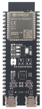
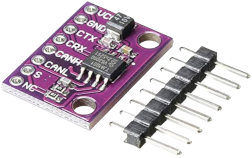
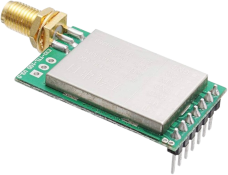

# Vehicle Module V1
Parse CAN bus messages and sends periodical updates to remote PC through LoRa

## Ingredients
### 1. ESP32S6-devkit-C

   - Microcontroller that will parse CAN messages and transmit through LoRa
### 2. TJA-1051 Breakout board

  - ESP32S6 CAN (TWAI) peripheral requires an external transceiver to convert the CANH, CANL differential signal to TTL logic
### 3. E32-TTL-100

   - UART --> LoRa module

## Wiring
|ESP32-S3| TJA1051|Note|
|----|----|----|
|GPIO 2|TX||
|GPIO 1|RX||
|$5V_{in}$|$V_{cc}$|External +5V Supply|
|GND|GND||
|3V3|$V_{io}$|Sets voltage level for TX/RX| 
|X|CANL| Connects to vehicle CANL|
|X|CANH| Connects to vehicle CANH|
|3V3|S| Silent mode (tx disabled)|

ESP32-S3|E32-LoRa|Note|
|----|----|----|
|GPIO 12|M0|Sets operating mode of LoRa module|
|GPIO 13|M1|Sets operating mode of LoRa module|
|GPIO 4|RXD|UART|
|GPIO 5|TXD|UART|
|GPIO 14|AUX|Indicates LoRa module status|
|$5V_{in}$|$V_{cc}$|External +5V Supply|
|GND|GND||
